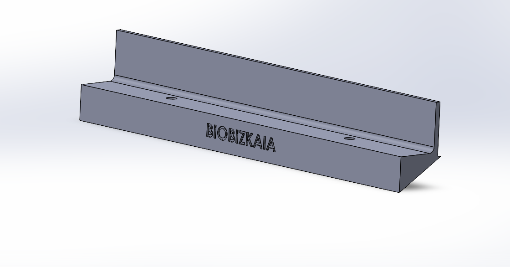
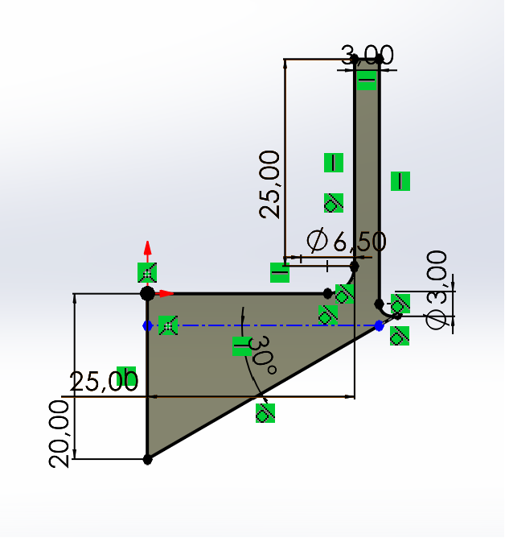
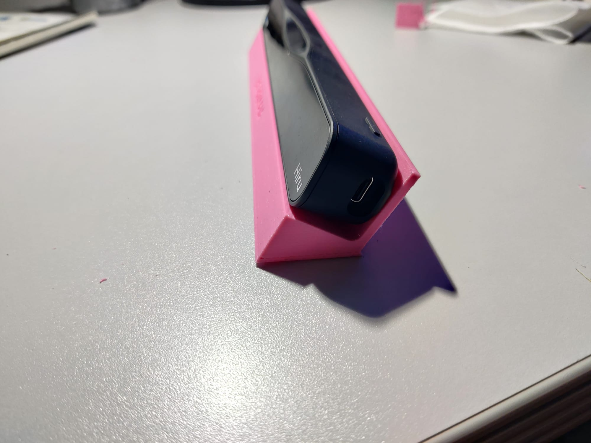
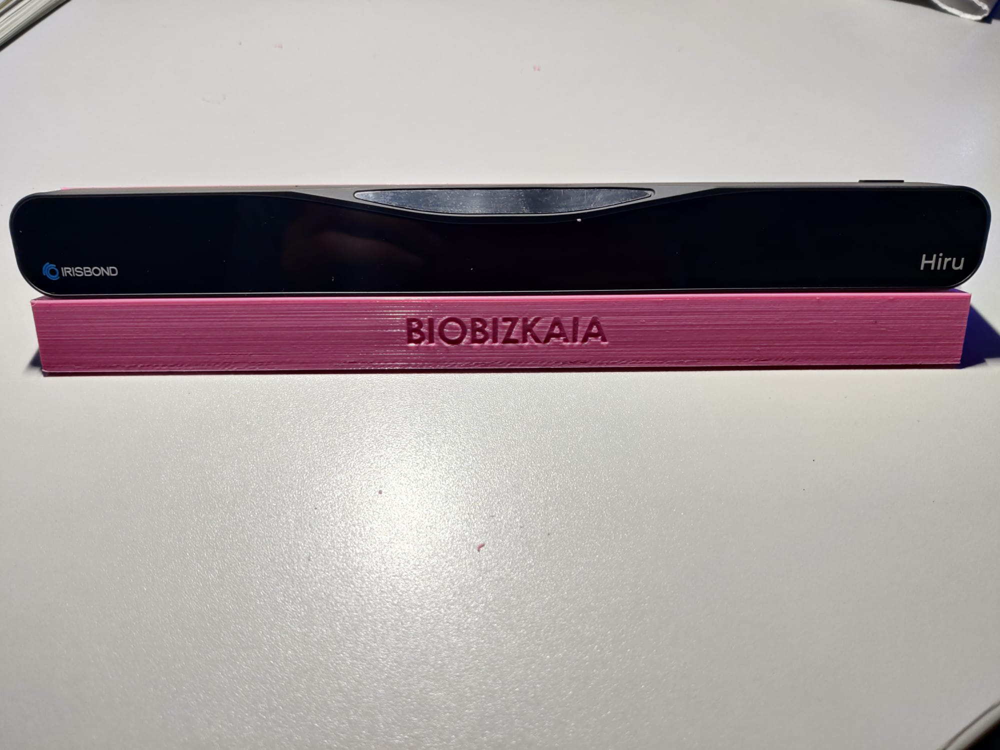
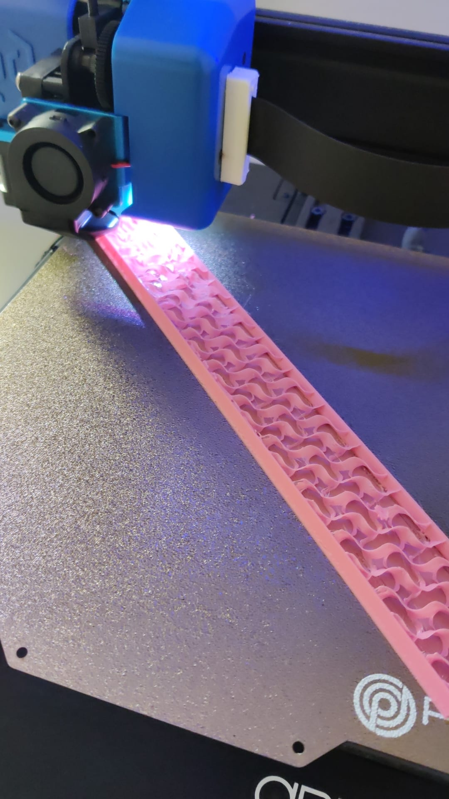

# HIRU IRISBOND SUPPORT

## Introduction
This project features a 3D printed support designed specifically for the Irisbond Eyetracker. It's intended to maintain a consistent 30º angle, facilitating accurate eye tracking during tests with patients.

## Features and Benefits
- **Stable 30º Angle**: Ensures optimal eye tracking performance.
- **Easy to Use**: Simple setup for healthcare professionals and researchers.
- **Durable Design**: Created for repeated use in clinical and research settings.

## Assembly Instructions
1. Print the support using PLA at a 20% infill density.
2. Attach the support to the Irisbond Eyetracker following the alignment markers. You can use the eyetracker's screws to ensure a secure grip.
3. Place the device on the laptop keyboard or on a flat surface, ensuring the angle is correctly set.

## Printing Requirements
- **Material**: PLA recommended for its ease of printing.
- **Infill Density**: 20% to ensure stability without excessive material use.

## License and Contributions
This project is released under the MIT License. Contributions are welcome; please feel free to submit pull requests or open issues for discussion.

