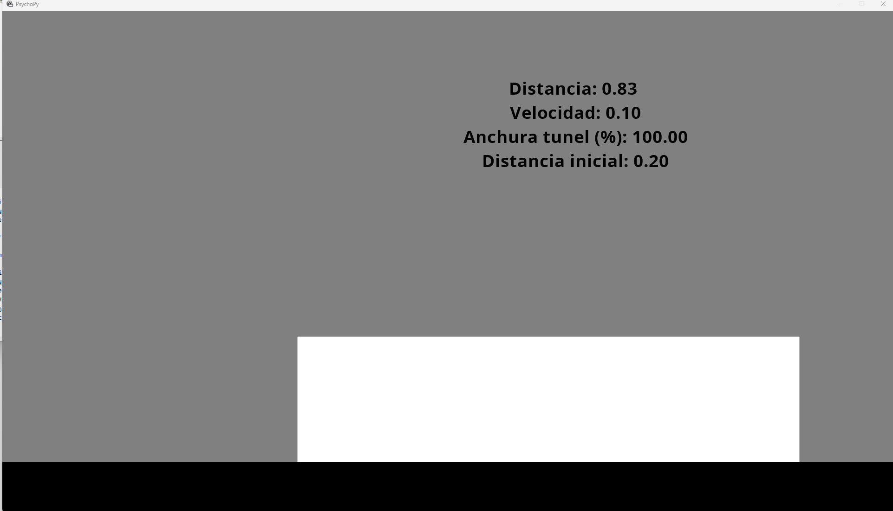
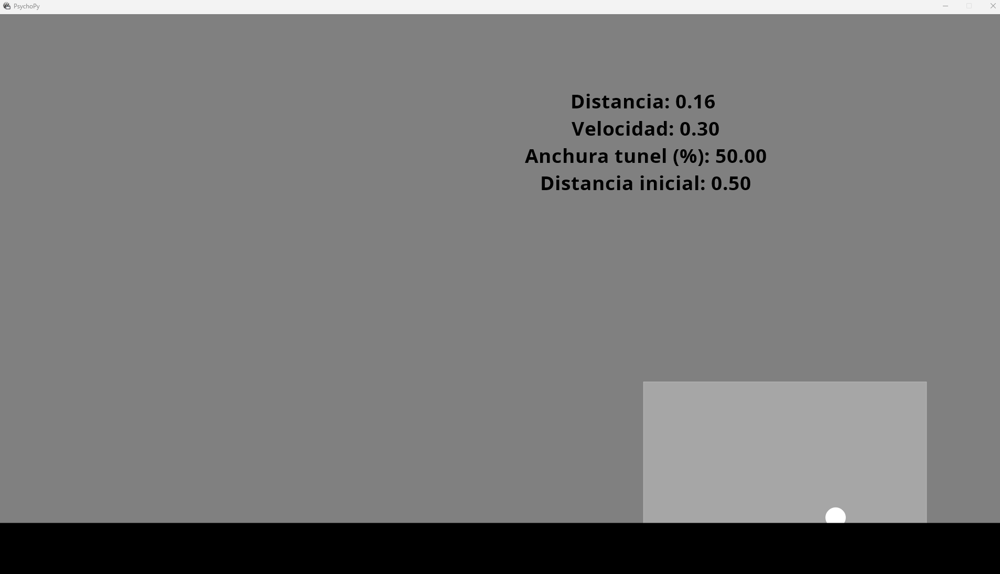
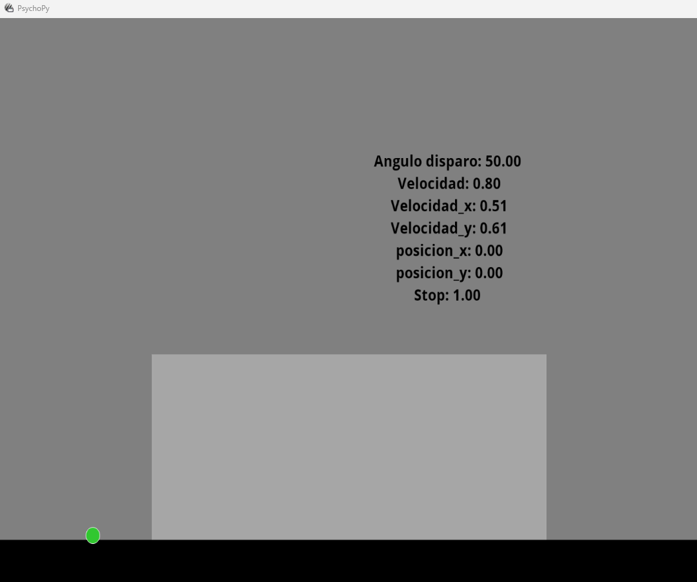
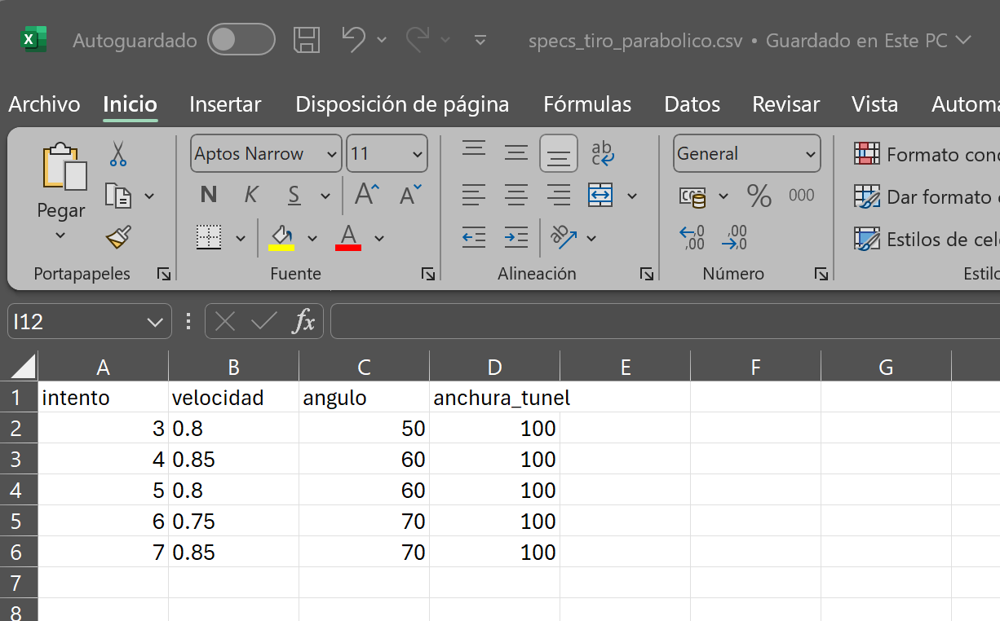

# Test for Measuring Patient Speed, Acceleration, and Trajectory Perception

This test is still in development and is part of the SiliconBurmuin project repository. It is designed to measure the patient's speed, acceleration, and trajectory perception. The input files for this test are in the .csv format.

## Test Structure

The test consists of two parts:

1. Speed Test: This test focuses on measuring the patient's speed perception. 
2. Parabolic Ball Test: This test evaluates the patient's acceleration perception and position tracking.

Input CSV shape: 

Please note that these tests are currently in the experimental phase and do not include any evaluation of the metrics obtained. They serve as a foundation for familiarizing with the PsychoPy toolbox. As experiments are selected for testing on patients, they will be further developed and completed.

For more information about the SiliconBurmuin project and its contributions to advancing neuromorphic technology research in healthcare and biomedical applications, please refer to the main repository's README.md file.

